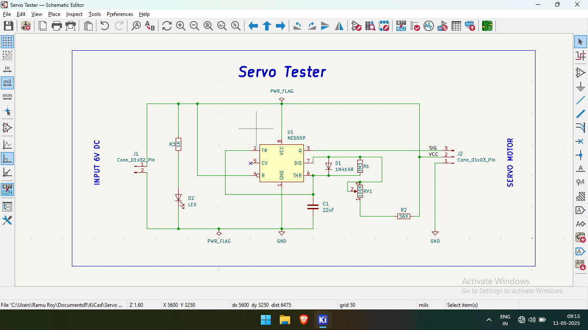
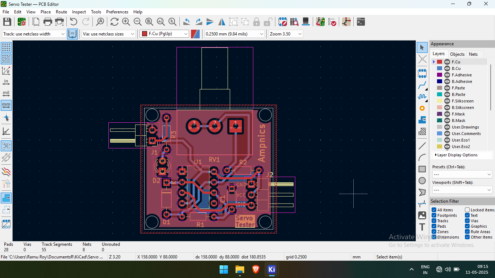

# ⚙️ Servo Tester using NE555 Timer

## 📌 Overview  
This is a **PCB design** for a **servo motor tester**, created using **KiCad**. The circuit is based on the **NE555 timer IC** in **astable mode**, generating PWM signals to control servo motor position. It's a simple tool useful for testing and calibrating servo motors without a microcontroller.

## 🛠️ Specifications  
- **Input Voltage**: 6V DC  
- **Timer IC**: NE555P  
- **PWM Output**: Variable duty cycle based on RC network  
- **Timing Components**:  
  - Potentiometer (for adjusting pulse width)  
  - Diode (1N4148) to shape timing  
  - Capacitor: 22nF  
  - Resistors: 56kΩ, others as required  
- **Indicators & Connectors**:  
  - LED with resistor for power indication  
  - 3-pin header for servo connection (VCC, GND, Signal)

## 📂 Project Files  
- **Schematics** → `/Schematics/`  
- **PCB Layout** → `/PCB_Design/`  
- **Gerber Files** → `/Gerber_Files/` (for manufacturing)  
- **Images** → `/Images/` (renders & screenshots)  

## 🖼️ Preview Images  
| Schematic | PCB Layout | 3D Render |
|-----------|------------|-----------|
|  |  |  |

## 🔧 How to Use  
1️⃣ **Open the KiCad files** in `/Schematics/` and `/PCB_Design/`.  
2️⃣ **Adjust the potentiometer** to vary the PWM signal.  
3️⃣ **Use the Gerber files** from `/Gerber_Files/` to order your PCB from a manufacturer.  
4️⃣ **Connect a servo** to the 3-pin header and power the circuit with 6V DC.

## 🙏 Credits  
This project was created with guidance from the **[Ampnics YouTube Channel](https://www.youtube.com/@ampnics)**. Thanks to their valuable tutorials!

## 🔗 Links  
- 🚀 **Project Discussion on LinkedIn**: [LinkedIn](https://www.linkedin.com/posts/ramu-roy-b780382b7_servotester-pcbdesign-ne555-activity-7327220204059430912-TQCX?utm_source=social_share_send&utm_medium=android_app&rcm=ACoAAEwAX4wBY70YZ3l58lvkiXtyCZcnWWrfJAA&utm_campaign=copy_link)  
- 📺 **Ampnics Tutorial Playlist**: [YouTube](https://youtube.com/playlist?list=PLxgq6Jtu7shQPHqYjKUVa28CmktTzHDLp&si=jp1xYo7E0JcdnXuT)

## 📜 License  
This project is licensed under the **MIT License** – feel free to use, share, and modify it!
