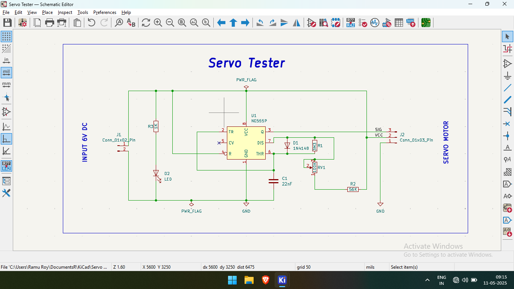
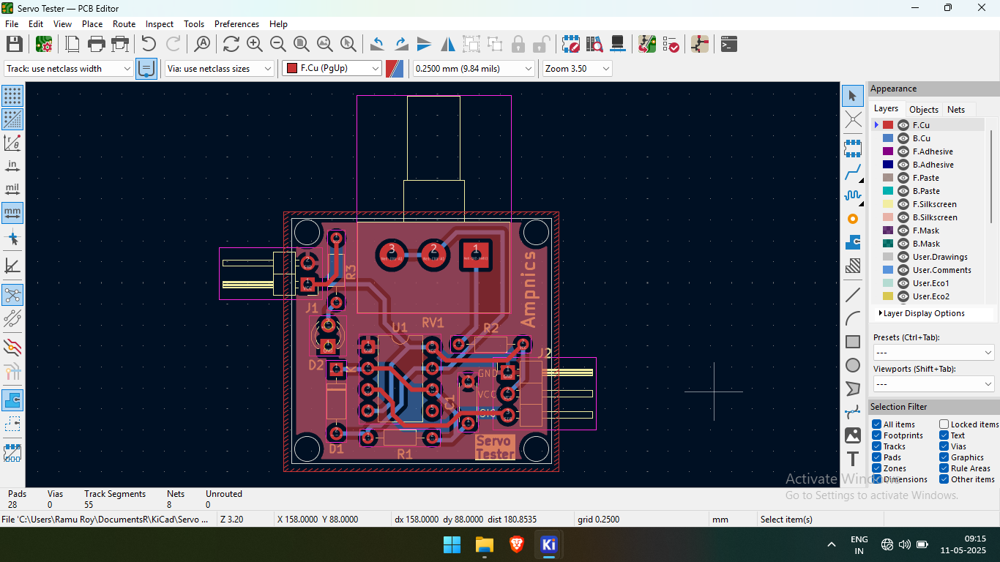
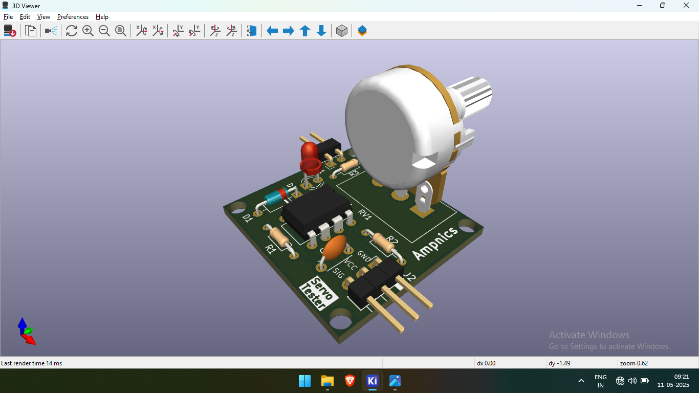

# ⚙️ Servo Tester using NE555 Timer

## 📌 Overview  
This is a **PCB design** for a **servo motor tester**, created using **KiCad**. The circuit is based on the **NE555 timer IC** in **astable mode**, generating PWM signals to control servo motor position. It's a simple tool useful for testing and calibrating servo motors without a microcontroller.

## 🛠️ Specifications  
- **Input Voltage**: 6V DC  
- **Timer IC**: NE555P  
- **PWM Output**: Variable duty cycle based on RC network  
- **Output**: 3-pin servo header (VCC, GND, Signal)

## 🧾 Bill of Materials
| Component | Value / Part | Qty |
|-----------|--------------|:---:|
| Timer IC | NE555P | 1 |
| Timing diode | 1N4148 | 1 |
| Timing capacitor | 22 nF | 1 |
| Resistor | 56 kΩ | 1 |
| Potentiometer (pulse-width adjust) | — | 1 |
| Power-indicator LED + resistor | — | 1 + 1 |
| Servo header | 3-pin (VCC/GND/Signal) | 1 |

> Key components from the design specifications; see the schematic for exact values of any remaining passives.

## 📂 What's in this repo
- **`Schematics/`** — KiCad schematic source (`Servo Tester.kicad_sch`) + exported PNG
- **`PCB_Design/`** — KiCad PCB source (`Servo Tester.kicad_pcb`) + exported PNG
- **`Gerber_Files/`** — ready-to-manufacture Gerbers (`Gerber files.zip`)
- **`Images/`** — schematic, layout, and 3D renders

## 🖼️ Preview Images  
| Schematic | PCB Layout | 3D Render |
|-----------|------------|-----------|
|  |  |  |

## 🔧 How to Use  
1️⃣ **Open the KiCad files** in `Schematics/` and `PCB_Design/` to review or customize the design.  
2️⃣ **Order the board** by sending `Gerber_Files/Gerber files.zip` to a PCB manufacturer (or regenerate Gerbers from the KiCad files).  
3️⃣ **Adjust the potentiometer** to vary the PWM signal.  
4️⃣ **Connect a servo** to the 3-pin header and power the circuit with 6V DC.

## 🙏 Credits  
This project was created with guidance from the **[Ampnics YouTube Channel](https://www.youtube.com/@ampnics)**. Thanks to their valuable tutorials!

## 🔗 Links  
- 🚀 **Project Discussion on LinkedIn**: [LinkedIn](https://www.linkedin.com/posts/ramu-roy-b780382b7_servotester-pcbdesign-ne555-activity-7327220204059430912-TQCX?utm_source=social_share_send&utm_medium=android_app&rcm=ACoAAEwAX4wBY70YZ3l58lvkiXtyCZcnWWrfJAA&utm_campaign=copy_link)  
- 📺 **Ampnics Tutorial Playlist**: [YouTube](https://youtube.com/playlist?list=PLxgq6Jtu7shQPHqYjKUVa28CmktTzHDLp&si=jp1xYo7E0JcdnXuT)

## 📜 License  
This project is licensed under the **MIT License** – feel free to use, share, and modify it!
